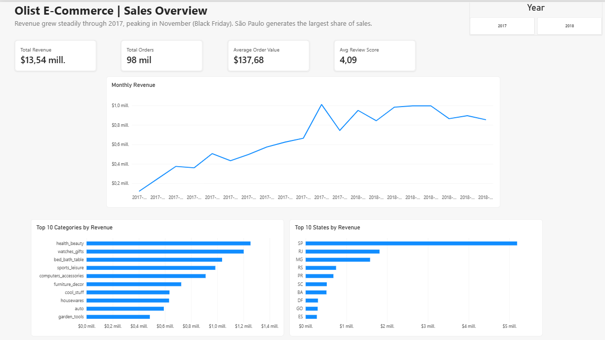
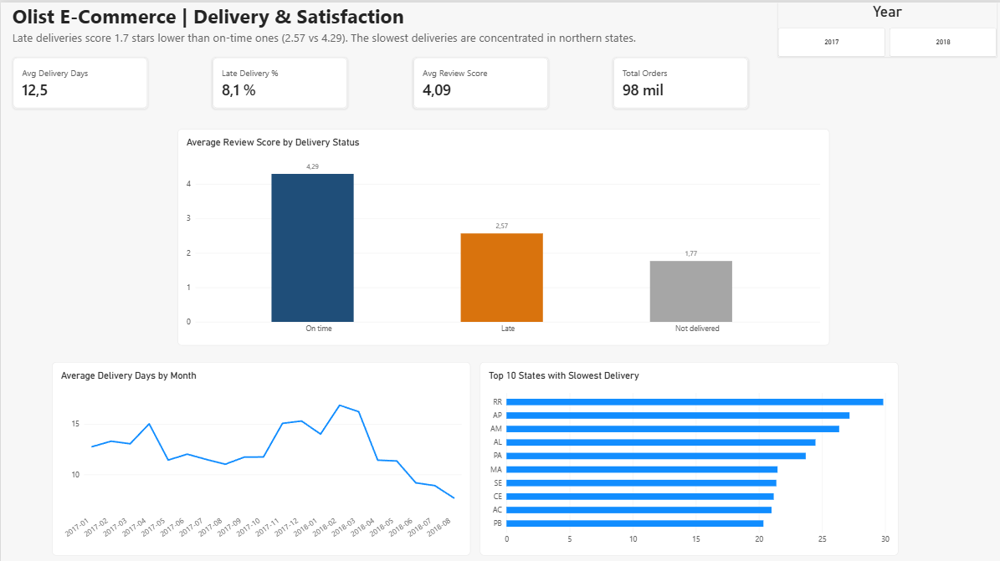
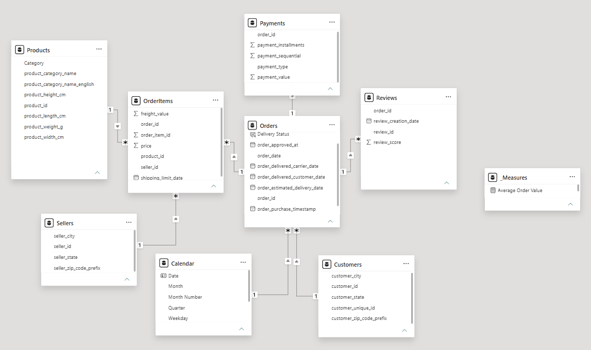

# Olist E-Commerce Dashboard — Power BI

Two-page Power BI report on ~100,000 real orders from Olist, a Brazilian e-commerce marketplace. It answers two questions: **what drives sales**, and **how delivery performance affects customer satisfaction**.

**Key finding:** orders delivered late are rated **1.7 stars lower** than on-time orders (2.57 vs. 4.29 out of 5).





---

## Key insights

- **Late delivery is the main driver of bad reviews.** On-time orders average 4.29 stars, late orders 2.57, and orders never delivered 1.77.
- **8.1% of delivered orders arrive after the estimated date**, with an average delivery time of about 12 days.
- **Delivery time depends heavily on location.** The slowest states are Roraima (RR), Amapá (AP), Amazonas (AM) and Alagoas (AL), in the north and northeast, while São Paulo is the fastest.
- **Revenue grew steadily through 2017 and peaked in November** (Black Friday).
- **São Paulo generates the largest share of revenue**, followed by Rio de Janeiro and Minas Gerais.
- **Top categories by revenue:** health & beauty, watches & gifts, and bed, bath & table.

## Dataset

[Brazilian E-Commerce Public Dataset by Olist](https://www.kaggle.com/datasets/olistbr/brazilian-ecommerce) (Kaggle). Orders placed between 2016 and 2018, split across 9 CSV files.

The data is **not stored in this repository**. Download it from Kaggle to reproduce the report.

## Data model

Star-style model with 7 tables plus a calendar table. All relationships are one-to-many with single-direction filtering.



| Table | Role | Grain |
|---|---|---|
| `OrderItems` | Fact | One row per product in an order |
| `Orders` | Fact / bridge | One row per order |
| `Payments` | Fact | One row per payment |
| `Reviews` | Fact | One row per review |
| `Products` | Dimension | One row per product |
| `Customers` | Dimension | One row per customer–order |
| `Sellers` | Dimension | One row per seller |
| `Calendar` | Dimension | One row per day (created in DAX) |

## Data preparation (Power Query)

| Problem found | Solution |
|---|---|
| CSV files use `.` as decimal separator, but the local Power BI setup expects `,` | Set the import locale to English (United States) so prices were not multiplied by 100 |
| Category names in Portuguese | Merged `Products` with the translation table (left outer join) |
| Translation table loaded without headers, so the first merge matched only 2,045 of 32,951 products | Promoted the first row to headers and re-ran the merge; validated the match count before accepting |
| Two categories have no English translation, and some products have no category | Conditional column: English name → Portuguese name → `unknown`, so real categories are not lost |
| City names in lowercase | Capitalized each word |
| Geolocation file (1M+ rows of duplicated coordinates) | Excluded: customer state and city already cover the analysis |
| Report file of 31 MB | Reduced to about 24 MB by disabling auto date/time tables and removing unused high-cardinality columns |

## DAX measures

```DAX
Total Revenue = SUM(OrderItems[price])

Total Orders = DISTINCTCOUNT(OrderItems[order_id])

Average Order Value = DIVIDE([Total Revenue], [Total Orders])

Avg Delivery Days =
AVERAGEX(
    FILTER(
        Orders,
        Orders[order_status] = "delivered"
            && NOT ISBLANK(Orders[order_delivered_customer_date])
    ),
    DATEDIFF(Orders[order_purchase_timestamp], Orders[order_delivered_customer_date], DAY)
)

Late Delivery % =
DIVIDE(
    COUNTROWS(FILTER(Orders, Orders[order_delivered_customer_date] > Orders[order_estimated_delivery_date])),
    COUNTROWS(FILTER(Orders, NOT ISBLANK(Orders[order_delivered_customer_date])))
)

Avg Review Score = AVERAGE(Reviews[review_score])
```

A calculated column, `Orders[Delivery Status]`, classifies each order as *On time*, *Late*, or *Not delivered* so it can be used as a chart axis.

## Design decisions and limitations

- **Revenue comes from `OrderItems[price]`, not from `Payments`.** It is the only source that allows revenue by category and seller. Freight is reported separately.
- **Orders are counted from `OrderItems`** so that product and seller filters apply. Orders with no items (cancelled or unavailable) are therefore excluded from the order count.
- **Report period limited to January 2017 – August 2018.** The first and last months of the dataset are incomplete and would show a false drop in sales.
- **The link between late delivery and low reviews is a correlation.** Other factors, such as product category or region, were not controlled for.

## Tools

Power BI Desktop · Power Query · DAX

## Files

```
├── olist-dashboard.pbix      # Power BI report
├── olist-dashboard.pdf       # Static export of both pages
├── images/                   # Screenshots used in this README
└── README.md
```

## Author

**Maria Paula Guaca Campo** — [LinkedIn](https://linkedin.com/in/mariapaulaguacacampo) · [GitHub](https://github.com/mariapaulaguaca-c)

```

## Author

**Maria Paula Guaca Campo** — [LinkedIn](https://linkedin.com/in/mariapaulaguacacampo) · [GitHub](https://github.com/mariapaulaguaca-c)

